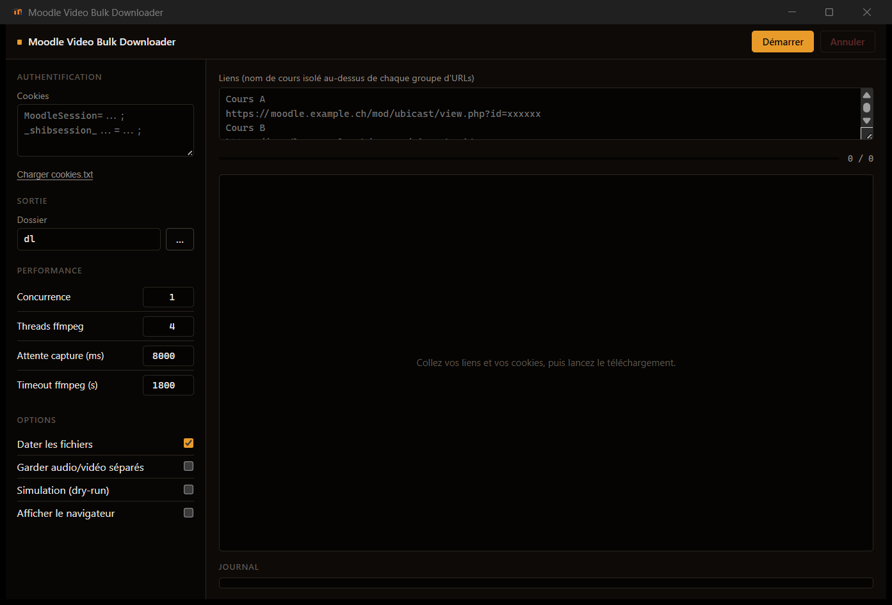

# Moodle Video Bulk Downloader

[](https://www.rust-lang.org/)
[](LICENSE)
[](CONTRIBUTING.md)

French version: [README_FR.md](README_FR.md)

## Disclaimer

1. This tool is for personal archiving only. Do not re-publish course recordings without your professor's explicit permission.
2. It may or may not work on all Moodle instances. Feel free to fork and open a pull request. *Originally built for moodle.unine.ch.*

## What it does

Point it at a Moodle/UbiCast replay page (or a course page, or a text file listing several), and it logs in with your session cookies, finds the audio and video HLS streams, downloads both in parallel with `ffmpeg`, and muxes them into a single MKV with `mkvmerge`. No Python, no `pip install`, no browser extension — one executable.

It's a full Rust rewrite of what used to be a Python/Playwright script. The core library, the CLI and the GUI all share the same download engine (`crates/core`); a bundled, headless Chromium driven over the DevTools protocol replaces what Playwright did before.

## GUI



Paste your cookies, paste your links (or a `liens.txt`-style list), pick an output folder, hit Démarrer. The table updates live as each video gets extracted, downloaded and muxed; settings are remembered between runs (cookies are not — you paste those fresh each time).

## Features

- Download a single replay, or point at a course page and let it auto-discover every UbiCast/mediaserver activity on it
- Parse grouped input files (course name on its own line, URLs underneath)
- Cookie-only authentication (`cookies.txt`, or paste directly into the GUI)
- Picks the best available video variant automatically (e.g. `1440p > 1080p`), probing nearby resolutions the page itself never linked to
- Audio and video streams download in parallel per video
- Stops waiting for stream URLs as soon as both are found instead of always sitting out the full timeout
- Automatic retry with exponential backoff (3 attempts, 5s then 10s)
- File date stamping: sets the file's modification time to the video's publish date, scraped from the page (`--no-set-file-date` to disable)
- Bounded concurrency across videos (`--concurrency` / GUI setting)
- Ctrl+C / Annuler kills every ffmpeg process immediately

## Getting the app

Either grab a built `MVBD-Portable` folder (GUI + CLI + ffmpeg/mkvmerge/Chromium, nothing else required), or build it yourself:

```powershell
cargo install tauri-cli --version "^2"
cargo build --workspace --release
```

## Authentication

Cookies are the only supported authentication method.

1. Log in to Moodle in your browser.
2. Open dev tools (`F12`) → Application/Storage → Cookies, pick your Moodle domain.
3. Copy at least `MoodleSession` and the SSO session cookie (e.g. `_shibsession_...`).
4. Paste them into `cookies.txt`, or straight into the GUI's cookie field. Both formats work:

One per line:

```text
MoodleSession=...
_shibsession_...=...
```

Or single-line, as copied from the browser:

```text
MoodleSession=...; _shibsession_...=...;
```

## Input file format

Example `liens.txt`:

```text
Course A
https://moodle.unine.ch/mod/ubicast/view.php?id=xxxxxx
https://moodle.unine.ch/mod/ubicast/view.php?id=xxxxxx
Course B
https://moodle.unine.ch/course/view.php?id=yyyyyy
```

A course page URL (`/course/view.php?...`) gets expanded automatically into every media activity found on it.

## CLI usage

```powershell
mvbd-cli.exe --input liens.txt
mvbd-cli.exe --url "https://moodle.unine.ch/mod/ubicast/view.php?id=xxxxxx"
mvbd-cli.exe --input liens.txt --concurrency 2
```

| Option | Default | Description |
| --- | --- | --- |
| `--cookie-file` | `cookies.txt` | Cookie file (KEY=VALUE or one-per-line) |
| `--concurrency` | `1` | Videos processed in parallel |
| `--download-threads` | `4` | ffmpeg threads per stream |
| `--capture-wait-ms` | `8000` | Max wait to capture stream URLs (exits early once found) |
| `--ffmpeg-timeout` | `1800` | Timeout (seconds) per audio/video download |
| `--output-dir` | `dl` | Output directory |
| `--no-set-file-date` | off | Disable file-date stamping |
| `--show-browser` | off | Show the Chromium window (debug) |
| `--keep-temp` | off | Keep the separate audio/video files |
| `--dry-run` | off | Print what would be downloaded without downloading |

## Building the portable folder

```powershell
scripts\build-portable.ps1
```

This builds both the CLI and the GUI in release mode, fetches ffmpeg/mkvmerge/Chromium into `tools/`, and assembles a self-contained `MVBD-Portable/` folder (and a matching `.zip`) — no Rust toolchain needed to run it, just double-click `mvbd-gui.exe`.

## Output

`dl/<Course Name>/<Recording Title>.mkv`

## Contributing

See [CONTRIBUTING.md](CONTRIBUTING.md).

## License

MIT — see [LICENSE](LICENSE).
